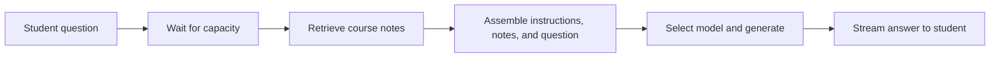

# Productionizing AI: operate a study assistant

Nimbus answers questions using university course notes. Your team will investigate
why its service is struggling, test one change, and check whether students get
reliable answers within the response-time and cost targets. **Productionizing**
means making an application dependable for its users and measuring whether it
meets those expectations.

Everything you need for the activity is on this page. Follow the steps in order:
**connect → measure → explain → change one setting → measure again → check quality**.

## 1. Connect to your team's service

You need a browser, internet access, Git, Python 3.10 or later, and the **service
URL and team token** from your facilitator. Use Cloud Shell or a macOS/Linux
terminal; on Windows, use Cloud Shell or WSL for these commands. The service is
already deployed. You do not need to install models, Docker, or cloud credentials.

Run these commands one line at a time. If you already have the repository, enter
its directory and start at `python3 -m venv`.

```bash
git clone https://github.com/anh-nguyen28/adsc-workshop.git
cd adsc-workshop
python3 -m venv .participant-venv
.participant-venv/bin/python -m pip install httpx==0.28.1
export PATH="$PWD/.participant-venv/bin:$PWD/cli:$PATH"
```

The virtual environment keeps the workshop's Python dependency separate from
other projects. `httpx` sends web requests. `PATH` lets your terminal find the
`nimbus` command and its Python environment.

Replace `YOUR-TEAM-SERVICE` and `YOUR-TEAM-TOKEN` with your facilitator's values:

```bash
nimbus init https://YOUR-TEAM-SERVICE.run.app YOUR-TEAM-TOKEN
nimbus brief
nimbus status
```

**You are connected when** `brief` prints your incident and targets, and `status`
prints the service settings. `init` checks service health; `status` also verifies
your token. Keep the token private—it permits reading and changing team settings.

Use the same terminal for the activity. Only one person per team should send
benchmark or evaluation traffic; teammates can interpret results and record notes.
Wait for each command to finish before starting the next.

## 2. See how an answer is produced

Open your team's service URL in a browser. Ask **“What is overfitting?”** and look
at the answer, selected notes, and request trace. A trace records the stages a
request passed through; it does not expose the model's private reasoning.

For an answer that needs to be generated, the main path is:



**Retrieval** finds relevant passages, called chunks. **Generation** uses the
assembled input, called a prompt, to write an answer. Combining these is
**retrieval-augmented generation (RAG)**. Relevant notes help ground an answer,
but you still need to check whether the answer uses them correctly.

A **cache** stores previous work for reuse. Nimbus can check for a similar cached
answer before retrieval, or an exact cached answer after assembling the prompt.
A cache hit skips some stages. Requests can also be rejected if a configured
waiting limit is reached.

Nimbus runs this sequence in code. An **agent** can let a model choose tools and
continue based on their results. This lab teaches the operating practices shared
by both; the agent discussion at the end covers additional controls for actions.

Finish your browser request before starting the benchmark.

## 3. Measure before changing anything

```bash
nimbus baseline
nimbus diagnose
```

A **benchmark** sends a repeatable set of requests and measures the results. Your
**baseline** is the measurement before any change; it may show an unhealthy
service. `baseline` warms the service, sends your incident's configured workload,
and saves a report. Warm-up requests are excluded from the reported sample.
`diagnose` redisplays that report and asks you to interpret it; it sends no new
benchmark traffic.

Read the report in this order:

| Look at                                 | What it tells you                                                                                  |
| --------------------------------------- | -------------------------------------------------------------------------------------------------- |
| Successful / rejected / failed requests | How many students received a complete, nonempty answer; fast successes can hide failures           |
| p95 latency                             | Response time near the slow end of the successful requests: the 95th percentile                    |
| Monthly cost                            | Token use projected onto the exercise's monthly traffic, plus an infrastructure allowance          |
| `p95 req`                               | Time spent in each stage of one request selected near the 95th percentile; these rows add up       |
| `p95 each`                              | A separate percentile for each stage; these rows can describe different requests and do not add up |
| Input / output tokens                   | Amount of text supplied to and generated by the model; useful clues about work per request         |

A model **token** is a unit of text, such as a word or part of a word. It is
unrelated to your private team credential. Provider output usage can include
reasoning tokens that do not appear in the visible answer.

Use the stage breakdown to locate the work:

| Signal                     | Meaning                                                                                                                     |
| -------------------------- | --------------------------------------------------------------------------------------------------------------------------- |
| Queue wait                 | Time waiting for a slot inside Nimbus                                                                                       |
| Retrieval                  | Time spent finding course-note passages                                                                                     |
| Generation                 | Time in the model generation stage, including provider waiting or retries                                                   |
| Client + network           | Time outside measured server stages; may include startup, platform waiting, transit, and client work                        |
| Time to first token (TTFT) | Time until the client sees the first answer text, which differs from completion time                                        |
| Concurrency                | Requests in progress at once; the benchmark's client limit and Nimbus's admission limit control different parts of the path |

For example, **0.4 s waiting + 0.2 s retrieving + 1.3 s generating + 0.1 s in
remaining work = 2.0 s** for one request. These are illustrative numbers, not your
targets. Generation is the largest stage, but input size, output length, or
provider retries could explain it; a larger model is not automatically the fix.

Write down the missed target, the relevant stage or token signal, and its value
and unit. Use the targets from `nimbus brief`. With a small sample such as 16
requests, a few slow responses can move p95 substantially.

## 4. Predict, change one setting, and measure again

Before changing anything, write one sentence:

> We think **_ because we measured _**. Changing **_ from _** to **_ should
> move _**. We will also check \_\_\_ to make sure it does not get worse.

Choose a setting from the [setting reference](#setting-reference) below. Record
your hypothesis, replacing the quoted placeholders with your own evidence:

```bash
nimbus hypothesis \
  --slice 'stage or signal we observed' \
  --proof 'measured value, unit, and comparison' \
  --lever 'SETTING_NAME' \
  --expect 'metric we predict will change and in which direction'
```

Add `--model` if your hypothesis implicates model generation. The change gate
requires a hypothesis but does not grade it; your team must explain the evidence.

Record the old setting value. Replace `KEY=VALUE` below with your chosen setting
and value; it is a placeholder, not a command to copy unchanged.

```bash
nimbus set KEY=VALUE
nimbus bench --label 'setting: old value to new value; predicted effect'
nimbus status
```

`set` updates the running service and prints the old and new values. `bench`
measures again. **Keep request count, arrival rate, and client concurrency the
same as the baseline.** Apply one setting between completed runs so you can
interpret its effect, even though the CLI accepts multiple settings.

Compare the result with your prediction. If it is worse, restore the old value
with `nimbus set` and benchmark again. If the result is close to a threshold,
repeat the same workload. Record a new hypothesis before another experiment.

## 5. Verify recovery and read the answers

```bash
nimbus eval
```

This checks 36 questions against the configuration from your latest benchmark:
24 fact-finding questions and 12 application or reasoning questions. It makes
real model calls; wait for it to finish. If settings changed since the benchmark,
run `nimbus bench` again before evaluating.

**`RECOVERY PASS` requires all of the following:**

- Latency and projected cost meet the targets.
- Every benchmark request succeeds.
- The answer-quality score meets the configured threshold.
- The observed configuration stays consistent during measurement and evaluation.

A latency/cost `2/2` alone does not establish recovery. The quality check looks
for expected keywords: wrong answers can contain them and correct paraphrases
can miss them. After evaluation, use the browser to inspect these answers:

| Ask                                               | Check                                                                      |
| ------------------------------------------------- | -------------------------------------------------------------------------- |
| “When are office hours?”                          | Does the answer match the retrieved syllabus notes?                        |
| “Should I use binary search on an unsorted list?” | Does the explanation correctly apply the notes?                            |
| “What is today's dining hall menu?”               | Does it acknowledge that the course notes do not provide this information? |

Record any error even if the automated check passes. Monthly cost is an exercise
projection, not your cloud bill; it does not fully count unsuccessful provider
calls. Missing provider usage means cost is unknown.

## 6. Explain your result

Copy this table into your notes and fill it from your runs. Mark anything you
did not measure as “unknown.” Keep credentials out of your notes.

| Evidence                                     | Before | After |
| -------------------------------------------- | ------ | ----- |
| Setting changed and its value                |        |       |
| Requests / arrival rate / client concurrency |        |       |
| Successful / rejected / failed requests      |        |       |
| p95 latency (seconds)                        |        |       |
| Relevant stage time or token count           |        |       |
| Projected monthly cost (USD)                 |        |       |
| Quality score, if evaluated                  |        |       |
| Recovery result                              |        |       |

Explain: **what students experienced → what you measured → what you changed →
what happened → whether answers remained useful → what is still uncertain**.
If recovery failed, explain the remaining failure and your next measurement.

## Setting reference

Use the setting that matches your evidence. These are options to investigate,
not a checklist of changes. Booleans accept `true` or `false`.

| Setting                    | Accepted values                           | Effect and tradeoff to check                                                                                                                        |
| -------------------------- | ----------------------------------------- | --------------------------------------------------------------------------------------------------------------------------------------------------- |
| `SYSTEM_PROMPT`            | `LONG`, `TRIMMED`, `VERBOSE`              | Select instructions; check input size and whether required answer behavior is preserved                                                             |
| `RETRIEVE_K`               | Integer 0–20                              | Select how many note chunks enter the prompt; fewer may reduce work but omit needed facts                                                           |
| `MAX_TOKENS`               | Integer 1–1024                            | Cap generated output; a low cap can truncate an answer or leave no visible text on a reasoning model                                                |
| `MODEL_TIER`               | `small`, `large`                          | Choose the default tier; `small` sends every question there, so check difficult questions                                                           |
| `ROUTE_EASY`               | Boolean                                   | With the large default, route short questions matching fixed patterns to the small tier; the rule can misjudge difficulty                           |
| `RESPONSE_CACHE`           | Boolean                                   | Reuse an answer for the same assembled prompt; retrieval still runs                                                                                 |
| `SEMANTIC_CACHE`           | Boolean                                   | Reuse an answer to a similar question before retrieval; similarity can hide a meaningful difference                                                 |
| `SEMANTIC_CACHE_THRESHOLD` | Number 0–1                                | Set required similarity; lowering it accepts more matches, including potentially wrong ones                                                         |
| `MAX_CONCURRENT`           | Integer 1–64                              | Limit simultaneous work inside Nimbus; raising it can move pressure to the model provider                                                           |
| `SHED_ABOVE_QUEUE`         | Integer ≥0; `SHED_ABOVE_QUEUE=` clears it | Reject requests beyond the waiting limit; check rejection counts alongside latency                                                                  |
| `PREFIX_CACHE`             | Boolean                                   | Request reuse of static prompt computation in the local adapter; cloud reuse is provider-managed, so this switch does not guarantee a cloud benefit |

## Apply the lesson to an agent

Suppose Nimbus could propose study sessions and create calendar events. A tool
is an operation the application exposes to the model, such as reading a calendar
or creating an event. Discuss these requirements for that extension:

| Concern                | What the agent would need                                                                           |
| ---------------------- | --------------------------------------------------------------------------------------------------- |
| Permissions            | Access only to authorized calendars, with permissions enforced outside the model                    |
| Valid actions          | Checked dates and tool arguments, and user review before events are created                         |
| Bounded work           | Limits on steps, elapsed time, retries, and spending                                                |
| Safe retries           | A way to identify an operation already completed so a lost reply does not cause a duplicate event   |
| Persistent state       | Saved progress so a restart does not lose track of completed actions                                |
| Untrusted content      | Treat instructions found in notes or tool results as data, not authority to gain permissions        |
| Evaluation             | Test the actual calendar state, denied actions, and partial failures as well as the final answer    |
| Monitoring and rollout | Trace tool outcomes, detect problems, release gradually, and restore a previous version when needed |

These controls are design work for an extension; Nimbus does not implement a
calendar agent. Its public chat endpoint and in-memory settings are workshop
choices. Wider deployment also needs user authentication, data and abuse controls,
and ongoing monitoring. A passing lab run establishes evidence for the tested
workload, not every future user or task.

## If something goes wrong

| What you see                                                              | What to do                                                                         |
| ------------------------------------------------------------------------- | ---------------------------------------------------------------------------------- |
| Git, Python, or environment setup fails                                   | Use Cloud Shell or a working teammate's terminal; ask a facilitator to check setup |
| `nimbus: command not found`                                               | Enter the repository directory and repeat the `export PATH=...` line from step 1   |
| A message asking you to run `nimbus init`                                 | Run `init` on this machine with your team's URL and token                          |
| Health warning or connection error                                        | Check the service URL with your facilitator                                        |
| `That token was not accepted` or benchmark needs authenticated `/metrics` | Check that the URL and token belong to the same team                               |
| `set` returns 409                                                         | Record your hypothesis before changing the setting                                 |
| Configuration changed before/during evaluation                            | Wait for all changes and traffic to finish, then benchmark and evaluate again      |
| Empty answers or every request fails                                      | Ask the facilitator to check service readiness and model access                    |

`init` saves credentials in a private `~/.nimbus.json` and starts a new session.
Run history is local and separated by service and session. In a new terminal,
return to the repository and repeat the `export PATH=...` line to continue;
running `init` again starts new history.

Settings, caches, and hypotheses live in service memory and can be lost on a
restart. If a restart occurs, have the facilitator check the service, inspect
`nimbus status`, and start a new session and baseline before comparing results.
