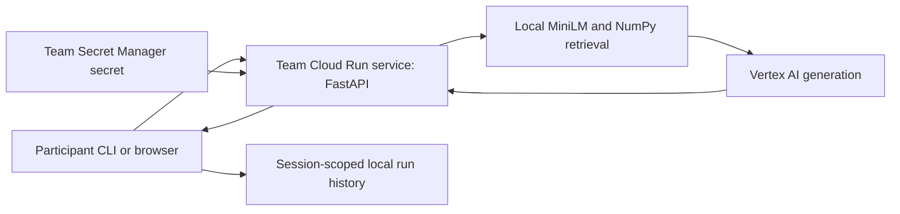

# Nimbus incident workshop

Nimbus is a small retrieval-augmented study assistant for practicing incident
investigation: **measure → attribute → record a hypothesis → change one thing →
measure again → verify answer quality**.

| Role | Start here |
| --- | --- |
| Participant | [Participant quickstart](participants/quickstart.md) |
| Engineer running checks | [Contributing](CONTRIBUTING.md) |
| Facilitator deploying and validating | [Cloud operations](deploy/README.md) |
| Engineer reviewing tradeoffs and evidence | [Development log](docs/DEVELOPMENT_LOG.md) |
| Engineer reviewing the original audit | [Historical architecture audit](docs/ENGINEERING_GUIDE.md) |

## Architecture



FastAPI handles admission, answer caching, retrieval, prompt construction,
model routing, and streamed answers with per-stage timings. The cloud service
uses its runtime identity for Vertex AI. There is no separate API gateway,
frontend server, vector database, or durable run-store service in this version.

One single-instance service per team isolates queues and caches. Each team gets
its own token. Runtime controls and declarations remain in process memory;
restarts reset them. A common immutable container digest is deployed to all teams.

The browser shows chat and request stages. The CLI drives diagnosis and quality
checks. Cloud Run benchmark jobs, Firestore history, and a projected recovery board
remain future scope, not prerequisites for the bounded workshop.

## Run locally

```bash
make setup PYTHON=python3.11
make check
make serve
```

Use a fresh VENV path if an existing environment has a different Python version.
Setup downloads dependencies and weights before serving; request-time downloads
are disabled. Docker/Ollama is an optional path described in CONTRIBUTING.md.

## Run a cloud workshop

The current default round-2 catalog assigns prompt and retrieval incidents.
Other cases remain experimental until their failure and recovery are measured.
After configuring the ignored `deploy/cloudrun.env`:

```bash
.venv/bin/python facilitators/deploy_incident.py --all --teams 2 --prefix nimbus-team
# Review the preview, then deploy:
.venv/bin/python facilitators/deploy_incident.py --all --teams 2 --prefix nimbus-team --run
.venv/bin/python facilitators/preflight.py --all-services --prefix nimbus-team-
```

Each participant uses their own URL/token with `nimbus init`, then `brief`,
`baseline`, `diagnose`, `hypothesis`, `set`, `bench`, and `eval`.

The report separates the p95-ranked request's additive ledger from independent
stage percentiles. It checks for incomplete/empty streams and separates histories
by service/session. Its latency/cost verdict is not recovery: recovery also
requires all benchmark requests to succeed, a stable observed configuration,
and the configured quality threshold on the 36-case keyword proxy.

Monthly costs are exercise projections. Small samples are noisy. Model quality,
IAM, image startup, and actual incident recovery need live evidence; unit tests
alone do not establish Cloud Run success.

Facilitator catalogs and answer keys discuss the causes. Do not distribute them
as participant instructions. Historical ladder materials should not be used as
the current run sheet; follow the current cloud operations and participant guides.
