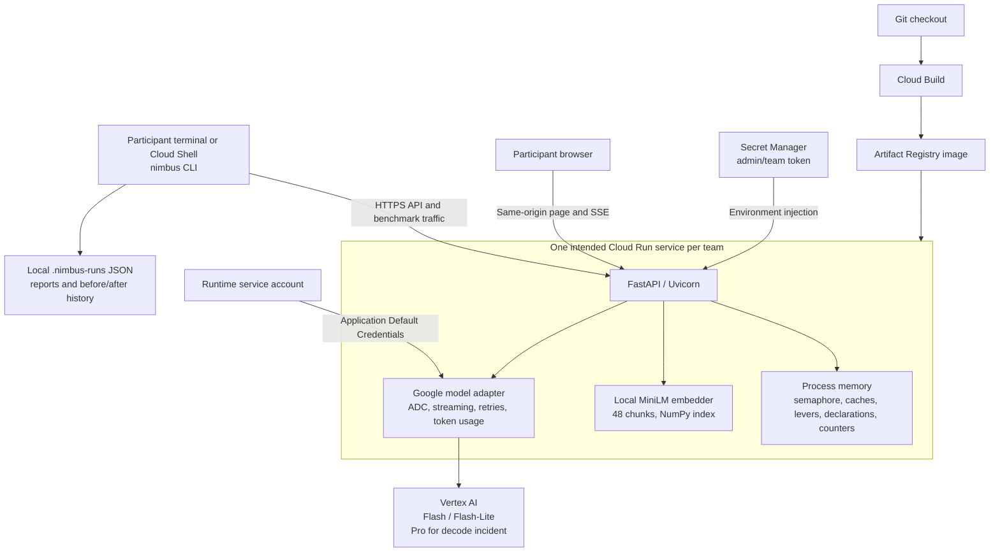
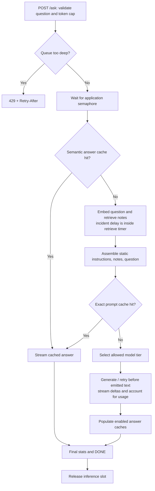
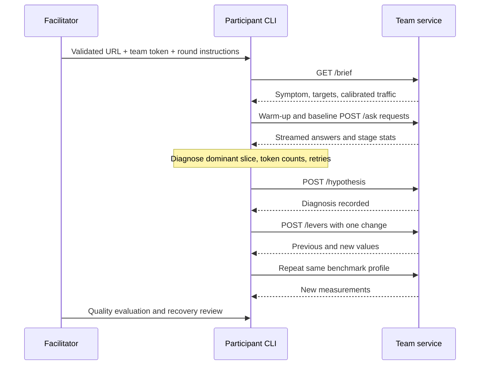

> Historical audit from 2026-09-05. Implementation has since changed. See
> [current cloud operations](../deploy/README.md) and [development decisions/evidence](DEVELOPMENT_LOG.md).

# Nimbus engineering guide and deployment audit

Verified 2026-09-05 against checkout `24b30df` and the live `adsc-nimbus` project in `us-central1`. This is an engineer/facilitator document: it discusses the incident mechanisms. Do not use it as the participant handout.

**The service runs locally and on Cloud Run. The full workshop is not ready to hand out yet.** Only `nimbus-eval` is deployed; its diagnosis gate is off. Local streaming, the diagnosis gate, and the unit suite work. Preflight, deployment image reuse, team authorization, measurement comparisons, and quality calibration need attention before a room deployment.

## What is in this workspace

`adsc-workshop/` is the application and its own Git repository. Its origin is `https://github.com/anh-nguyen28/adsc-workshop.git`. The parent folder contains talk planning documents. The sibling `demo-repository/` is an unrelated GitHub sample.

| Component | Responsibility | Start reading |
| --- | --- | --- |
| Service | FastAPI endpoints, admission, SSE streaming, runtime changes | [app.py](../service/app.py) |
| Runtime configuration | Backend selection and the validated lever allow-list | [config.py](../service/config.py) |
| Retrieval | Markdown sections, MiniLM embeddings, normalized NumPy search | [build_index.py](../data/build_index.py), [retrieval.py](../service/retrieval.py), [embed.py](../service/embed.py) |
| Optimization controls | Prompt assembly, exact/semantic caches, heuristic routing | [levers.py](../service/levers.py) |
| Generation | Local Transformers, local Ollama, or Google managed APIs | [model.py](../service/model.py), [ollama_model.py](../service/ollama_model.py), [cloud_model.py](../service/cloud_model.py) |
| Instrument | Poisson load, SSE parsing, additive latency ledger, cost projection | [run.py](../benchmark/run.py), [report.py](../benchmark/report.py), [scenario.json](../scenario.json) |
| Participant interface | Investigation commands and local run history | [cli/nimbus](../cli/nimbus), [quickstart](../participants/quickstart.md) |
| Facilitator tooling | Incident catalog, deployment, calibration, quality evaluation | [facilitators/](../facilitators/) |
| Cloud artifact | Python 3.11 image, build-time retrieval index, non-root runtime | [Dockerfile](../Dockerfile), [deploy.sh](../deploy/deploy.sh) |
| Local containers | Nimbus plus Ollama and sequential model-pull jobs | [Compose file](../docker-compose.local.yml) |

`DEV_PLAN.md` describes a broader design; `BUILD_STATUS.md` records prior evidence and open work. Both were already **untracked** in this checkout, so a fresh clone does not receive them. Some plan features are deliberately unbuilt: Firestore run storage, a Cloud Run benchmark job, a projected board, and a browser diagnosis workflow. The browser currently provides chat and request-stage visualization.

## System architecture



There is one backend proxy, no separate frontend deployment, and no vector database. Course notes and the embedding model are packaged into the image. Cloud generation weights remain with the model provider. The runtime service account needs model access and access to the configured secret; the build and deploy identities have separate responsibilities.

Process-local state is an operational constraint. A replacement instance loses lever changes, declarations, caches, and counters. More workers or more instances introduce independent copies of that state. Keep the current workshop on one worker and one instance per service; externalize state before relying on scale-out. Minimum instances reduce cold starts but do not preserve a particular process: Google documents that minimum instances may restart at any time. [Cloud Run minimum instances](https://docs.cloud.google.com/run/docs/configuring/min-instances)

### Request workflow



All admitted requests, including cache hits, first wait for an inference slot. Semantic hits skip retrieval and generation; **exact hits still perform retrieval and prompt assembly** because the key is the assembled prompt. Some existing documentation incorrectly says exact hits skip retrieval too.

`PREFIX_CACHE` has a concrete Transformers KV-cache implementation locally. Google and Ollama manage their own prompt caches; toggling the app flag is not evidence of a cloud cache discount. Inspect actual `tokens_cached` and provider usage.

SSE contains `trace`, `delta`, `stats`, optional `error`, and `[DONE]`. An error after streaming begins can arrive under HTTP 200; clients must inspect the stream. The benchmark handles that case. Question length is bounded to 4,000 characters and request-level output overrides to 1,024 tokens in the current code.

### API and state ownership

| Endpoint | Access | Purpose |
| --- | --- | --- |
| `GET /`, `/health`, `/brief` | Public | Chat UI, process readiness, public symptom/targets/traffic |
| `POST /ask` | Public | Retrieval and streamed inference; can incur provider usage |
| `GET /metrics` | Admin/team token | Current config, provider settings, counters and caches |
| `POST /hypothesis`, `GET /declarations` | Admin/team token | In-memory diagnosis and change record |
| `POST /levers` | Admin/team token, optional hypothesis gate | Validate a batch, apply in memory, clear answer caches, replace semaphore |
| `POST /reload` | Admin/team token | Re-read the container's config and environment; reset caches/counters |

Authentication uses `X-Nimbus-Admin-Token`. Local mode permits administrative operations without a token if no token is configured. Cloud mode rejects them if no secret is configured. There is currently no distinct facilitator role: the team token is the admin token, and the deployment helper defaults every service to the same secret.

`/reload` cannot load edits made only on a facilitator's laptop into a remote container. Runtime levers are the fast control path, including `MAX_CONCURRENT`; changing Cloud Run resources, instance counts, model IDs, or injected faults uses deployment configuration. Change levers between completed benchmark runs: replacing a semaphore during active traffic allows old and new admission pools to overlap temporarily.

## Current cloud deployment and measured run

| Item | Observed value |
| --- | --- |
| Project / region | `adsc-nimbus` / `us-central1` |
| Services found | Only `nimbus-eval`; no `nimbus-team-*` services |
| Public URL | [Nimbus eval](https://nimbus-eval-h7zuiuiwtq-uc.a.run.app) |
| Serving revision | `nimbus-eval-00001-2lf`, 100% traffic, Ready |
| Image reference | `us-central1-docker.pkg.dev/adsc-nimbus/nimbus/nimbus-eval:9caa0d7` |
| Resources | 1 vCPU, 1 GiB, service minimum 1 / maximum 1 |
| Platform concurrency / timeout | 80 / 3,600 seconds |
| Runtime identity | `nimbus-runtime@adsc-nimbus.iam.gserviceaccount.com` |
| Secret reference | `nimbus-admin-token:latest`; value never saved in audit artifacts |
| Models | Large: `gemini-2.5-flash`; small: `gemini-2.5-flash-lite` |
| In-process capacity | `MAX_CONCURRENT=1`, `REPLICAS=1` |
| Runtime settings | TRIMMED prompt, 3 retrieved chunks, 32 output tokens, answer caches off, shedding threshold 4 |
| Hypothesis gate | **Disabled**; declarations initially empty |

The image tag differs from the checkout commit. This is a provenance warning, not proof that all deployed code is old: the deploy script builds dirty worktrees under a commit-derived tag, and the live service exposes features added after that tagged commit. Record the immutable image digest and build source when promoting a deployment.

The audit sent a real question, then used the CLI's warm-up, service-provided traffic profile, and benchmark implementation. Cloud settings were not changed.

| Measurement | Cloud baseline | Local smoke |
| --- | --- | --- |
| Backend | Google / Gemini Flash | Transformers / SmolLM2 large |
| Offered profile | 16 requests, 4/s, concurrency 8 | 4 requests, 1/s, concurrency 2 |
| Outcomes | 12 successful, 4 shed, 0 failed | 4 successful, 0 shed, 0 failed |
| p95 latency | **3.19 s** | **5.57 s** |
| p95 TTFT | 3.00 s | 3.08 s |
| Dominant component | Queue: 2.65 s, 83% | Generation: 5.55 s, approximately 100% |
| Input / output tokens per model call | 223 / 31 | 792 / 32 |
| Ledger residual | +0.0% | +0.0% |
| Report verdict | 1/2 constraints; latency FAIL, modeled cost PASS | 0/2 under cloud-calibrated exercise targets |

The cloud run presents the intended queue symptom. Its 25% shed rate is also user-visible failure and must be reported alongside latency. The current report's two constraints do not enforce an availability target or evaluate answer quality.

The reported **$786/month is an exercise projection**, using 150,000 requests/day and a fixed $140 infrastructure allowance. It is not the bill for this benchmark or a measured forecast for this single service. Cost accounting excludes unsuccessful requests and therefore is not a complete provider billing reconciliation. Use actual billing data for operating expenditure.

The first cloud answer spent 2.56 seconds in retrieval before warm-up; warm benchmark retrieval fell to approximately 0.02 seconds in the p95 request. This reinforces the need to warm before diagnosing. These are small samples from this machine's network path, not a capacity certification or a new calibration.

Local artifacts, excluded from ordinary source changes:

- [Cloud service evidence](../results/engineering-audit-2026-09-05-cloud-service.json)
- [Cloud raw baseline](../results/engineering-audit-2026-09-05-cloud-run.json)
- [Local raw smoke](../results/engineering-audit-2026-09-05-local-run.json)

## Setup and verification that actually ran

Read `CONTRIBUTING.md`, the Makefile, deployment scripts, participant guides, and the design/status documents before testing. No applicable `AGENTS.md` was found.

| Check | Result |
| --- | --- |
| `make setup` | Completed after network access was allowed; dependencies installed, 48 × 384 index rebuilt, both local generation tiers and embedder prefetched |
| `python -m unittest discover -s tests` | 88 passing on both existing Python 3.13 and Python 3.14 environments |
| Dependency verification | Five missing Google-auth-related packages installed for `.venv/bin/python`; declared pins then checked |
| `pip check` | No broken requirements |
| `compileall`, `bash -n deploy/deploy.sh`, `git diff --check` | Passed |
| `make serve` | Started successfully after permission to bind port 8000 |
| Real local `/ask` | Streamed a grounded Big-O answer and complete timing/token stats |
| Local hypothesis workflow | `/levers` returned 409 before hypothesis, then 200 afterward; original token-cap setting restored |
| Cloud authenticated reads | `/metrics` and `/declarations` accepted the correct token; missing/wrong tokens returned 401 |
| Cloud real inference and baseline | Completed; measurements above |
| Preflight failure reproductions | Confirmed with mocked HTTP: false success on blocked tier change; small tier changed to large afterward |
| Docker / devcontainer | Not built; Docker daemon is stopped |
| New cloud deployment / full room / new quality evaluation | Not performed |

The temporary local server was stopped after verification. No cloud revision, settings, IAM policy, or secret was changed. Model requests incremented normal service counters.

### Reliable local engineer commands

For a **fresh** environment, use Python 3.11 to match the Dockerfile and devcontainer. The commands below spell out the setup steps to keep pip and Python on the same interpreter:

```bash
python3.11 -m venv .venv
.venv/bin/python -m pip install --upgrade pip
.venv/bin/python -m pip install -r requirements.txt
NIMBUS_ALLOW_MODEL_DOWNLOAD=1 .venv/bin/python data/build_index.py
.venv/bin/python .devcontainer/prefetch.py
.venv/bin/python -m unittest discover -s tests
.venv/bin/python -m uvicorn app:app --app-dir service --host 127.0.0.1 --port 8000
```

Use another terminal for `make bench ARGS="--requests 4 --concurrency 2 --rate 1"`. Use the Google scenario verdict only for the calibrated cloud activity, not as the local acceptance criterion.

This machine's existing `.venv/bin/python` points to 3.13, while pip/uvicorn scripts point to 3.14. `make setup` does not prevent that mismatch. Dependencies were completed for the 3.13 interpreter too; prefer `.venv/bin/python -m pip` and `.venv/bin/python -m uvicorn` until the environment is recreated consistently. Python 3.14 setup built NumPy from source, adding setup time. The listed package versions are pinned, but the install also resolves unpinned `setuptools`; the container and Ollama base image tags are mutable.

The Docker alternative remains `make docker-up`, then `/health` and `make docker-bench`. It starts Ollama, pulls the configured small and large models in sequence, then starts Nimbus. Both tiers default to `llama3.1:8b`, so a default tier switch does not compare different models. `make docker-down` preserves the named model volume.

## Participant workflow



Participants need the lightweight CLI dependency, not model weights or Google model credentials. In a fresh Cloud Shell checkout:

```bash
git clone https://github.com/anh-nguyen28/adsc-workshop.git
cd adsc-workshop
python3 -m venv .participant-venv
.participant-venv/bin/python -m pip install httpx==0.28.1
export PATH="$PWD/.participant-venv/bin:$PWD/cli:$PATH"
nimbus init https://TEAM-SERVICE.run.app TEAM-TOKEN
nimbus brief
nimbus baseline
nimbus diagnose
nimbus hypothesis --slice 'observed dominant stage' --proof 'measured evidence'
# Choose a lever based on the diagnosis; change one value at a time.
nimbus set KEY=VALUE
nimbus bench --label 'one change and expected effect'
nimbus status
```

The placeholders above must come from the facilitator. `nimbus init` stores URL/token in `~/.nimbus.json`; keep that file private. Environment variables `NIMBUS_URL` and `NIMBUS_TOKEN` can select the service instead.

The app gate enforces only that **some hypothesis exists**. It does not verify a baseline was measured, grade the diagnosis, limit a request to one lever, or demand a fresh hypothesis after every change. The facilitator still owns these exercise rules.

Before changing teams or rounds, archive `.nimbus-runs/` and start a new history. The current CLI does not partition history by URL/session, and `init` does not reset it. One terminal should drive a team's benchmark at a time; simultaneous team members change the workload being measured.

## Engineer and facilitator deployment workflow

1. Prepare a deliberate source revision, image identity, project/region, runtime account, and per-team secret mapping. Ensure Cloud Run, Cloud Build, Artifact Registry, Vertex AI, and Secret Manager are enabled. Validate the actual build identity and its source-read/artifact-write/log permissions instead of assuming which default account Cloud Build uses.
2. Configure `deploy/cloudrun.env`. Export its assignments for direct shell deployment:

   ```bash
   set -a
   source deploy/cloudrun.env
   set +a
   ```

   Plain `source` does not export the template's assignments into `bash deploy/deploy.sh`. The incident helper already wraps sourcing in `set -a`.
3. Preview an incident deployment:

   ```bash
   .venv/bin/python facilitators/deploy_incident.py --incident retrieval --service nimbus-team-a
   ```

   Actual deployment adds `--run`. `--all --prefix nimbus-team` also only previews without `--run`. `--rounds` provisions separate round-1 and round-2 services; it doubles the service count. Resolve the multi-service image defect below before using the batch deployment path.
4. Apply the whole incident: healthy starting controls plus incident overrides, public brief, traffic profile, provider/model settings, and gate. Set Cloud Run concurrency above app admission for the queue exercise. The template uses 80, while direct script defaults use 2; do not omit the template accidentally. These are distinct admission controls. [Cloud Run concurrency configuration](https://docs.cloud.google.com/run/docs/configuring/concurrency)
5. Verify readiness, authenticated metrics, real text, actual model identity and usage on **both** intended tiers, gate behavior, incident confidentiality, and a warm baseline. Recheck the original incident configuration afterward. Do not treat the present `preflight.py` green message as sufficient evidence.
6. Rehearse two teams end to end, with different incidents, using the actual participant handout. Measure total elapsed workshop time. Resolve the quality-axis problem before assigning its incidents.
7. During the session, change runtime levers between runs; avoid image builds and shared load. Preserve the service URL/revision, traffic profile, before/after settings, outcome counts, stage ledger, tokens, retries, and quality result.
8. After the session, preserve evidence, then deliberately reduce minimum instances or retire temporary services. This audit did neither. Warm idle instances incur charges depending on billing mode. [Cloud Run minimum-instance billing](https://docs.cloud.google.com/run/docs/configuring/min-instances#billing)

For Flash and Flash-Lite, the deployed thinking budget is zero. The decode incident uses Pro with a different budget; use the adapter's model-specific handling rather than applying one budget to every model. Google's model-specific thinking guidance distinguishes these controls. [Thinking configuration](https://docs.cloud.google.com/vertex-ai/generative-ai/docs/thinking)

## Findings to resolve before a full-room session

| Priority | Finding and evidence | Engineering action |
| --- | --- | --- |
| P1 | **Preflight can certify an untested model and alter the incident.** `preflight.py:101–140` swallows 409 from `/levers`, never asserts returned model identity, and always restores `large`. Reproductions called `large, large` with no problems; starting at `small` called `small, small` and ended at `large`. Without a token it skips the small tier but can still print ready. | Require successful switches and actual model checks, preserve/restore original controls and gate state, and fail or mark incomplete when either tier cannot be tested. Test on a disposable service until preservation is proven. |
| P1 | **Build-once/deploy-many does not share an image path.** `deploy.sh:48` includes `${SERVICE}` in `IMAGE`; the helper sets `NIMBUS_SKIP_BUILD=1` after the first service. A clean tree skips the second build but points at the second service's different, potentially nonexistent image. A dirty tree instead rebuilds each service. Confirmed by code inspection; no room was deployed. | Build one service-independent image, resolve its digest, and explicitly pass that same digest to all team deployments. Add a batch-path regression check. |
| P1 | **Team credentials are shared by default.** The helper explicitly prints that every service uses `nimbus-admin-token`; service separation gives queue/cache isolation, not team authorization isolation. | Provision a distinct secret per team and bind each service to it. Separate facilitator and participant capabilities if stronger control is required. |
| P1 | **Quality incidents currently pass their intended failure bar.** Prior measured results in `BUILD_STATUS.md`: healthy 94.4%, cheapmodel 86.1%, staleness 91.7%, versus an 80% bar. Those quality results were not rerun in this audit. | Redesign or recalibrate the quality incidents/evaluation, then regenerate measured artifacts. Do not advertise those failures as demonstrated. |
| P1 | **A fresh clone is missing key instructions, and published commands drift.** Design/status files are untracked, participant clone URL is `YOUR-ORG`, direct deployment omits export, and several examples omit the required `--run`. Older handouts still describe the rung ladder or a facilitator-only token. | Decide which design/status material belongs in Git; publish one tested participant path and one tested facilitator path using the real origin. |
| P2 | **Measurement comparisons cross incompatible contexts.** `report.py:91` ignores `baselines._backend`; the local run printed +250% input tokens against a Google baseline. Previous-run comparison only checks successful requests. CLI history spans teams/URLs and hardcodes Google runtime metadata with empty config/args. | Partition by service/session/backend and capture actual runtime, configuration, profile, revision and model. Refuse unmatched baseline comparisons. |
| P2 | **Readiness is weaker than recovery.** `/health` reports startup readiness, not proof of model access. The report checks latency/cost only; 4/16 cloud requests were shed. | Require a real model call and explicit outcome/quality checks before declaring recovery. Keep cold-start warm-up outside diagnostic runs. |
| P2 | **Runtime changes are ephemeral and not safe for scale-out.** Configuration, caches, declarations, counters and semaphores live in one process. The live gate is disabled. | Enable the round-2 gate explicitly, keep one instance/worker for the existing exercise, and design durable shared state before adding replicas. |
| P2 | **Setup can install into a different interpreter than tests use.** Confirmed 3.13/3.14 split; tests passed with Google auth absent because the adapter tests mock authentication. | Select and validate one interpreter, invoke pip/uvicorn through it, and add a fresh-environment startup check alongside contract tests. |
| P2 | **Image/source identity is not trustworthy from the tag alone.** Dirty builds reuse the commit-derived tag; the live image is tagged `9caa0d7` while HEAD is `24b30df`. | Use immutable digests and record build provenance; promote reviewed source consistently. |

Additional housekeeping: no `.github` CI workflows exist in the workshop repository despite documentation referring to CI; the sibling demo workflows are unrelated. `.Dockerfile.swp` remains tracked even though `*.swp` is now ignored. Neither was changed in this audit.

## Measurement, calibration, and troubleshooting

The `p95 req` ledger decomposes one p95-ranked successful request and must sum to its end-to-end latency. `p95 each` shows independent stage percentiles and must **not** be summed. At 16 or fewer successful requests these are coarse order statistics. Treat near-threshold results as uncertain and repeat comparable warm runs.

Maintain the repeating prompt corpus, use `/brief` traffic for the incident, and compare against the healthy environment for that backend. Queue incidents need offered concurrency above application admission; calm non-queue incidents use their own profile to keep queue pressure from hiding the intended fault.

Use `facilitators/calibrate_incidents.py` for the incident design; `calibrate.py` is the older ladder path. Inspect `--help` and remote options before running a calibration, because it intentionally changes configurations/deployments. `eval_all.py` patches local `config.py` and calls `/reload`; pointing it at Cloud Run does not copy those local edits into the container. For a remote quality comparison, explicitly apply verified remote settings and use `facilitators/eval.py` against that configuration.

Run calibration alone, on the target deployment and traffic profile. Regenerate signatures, panels, answer keys, and eval cards from measurements rather than editing generated values by hand. A corrected quality design and full-room rehearsal are still required.

| Symptom | First check |
| --- | --- |
| Healthy service, failed answers | Inspect SSE error events, model identity/access, region and usage; startup does not prove a model request works |
| Healthy timing, empty/truncated text | Output cap and model-specific thinking budget; inspect actual answer text |
| Queue expected, but zero app queue wait | Platform concurrency may be too low, or benchmark concurrency may equal app admission |
| Every incident looks generation-bound | Wrong traffic profile, simultaneous benchmarks, or cold runtime |
| 401 on CLI/admin operations | Correct service URL and team token; `NIMBUS_URL` overrides the saved CLI configuration |
| 409 on a lever change | Record a hypothesis; verify round/gate configuration |
| A setting disappears | Instance restart/revision change or `/reload`; runtime lever changes are not durable |
| Docker setup cannot start | Confirm daemon availability before builds and model pulls |
| Local token baseline looks like a prompt incident | Known cross-backend report bug; inspect actual backend and comparison metadata |
| A deployment preview creates no service | Add `--run` only when ready to deploy; preview is the helper's default |

The next engineering milestone is a corrected preflight and common-image deployment path, followed by two isolated team services completing the same measured diagnosis/change/quality loop within twenty minutes.
